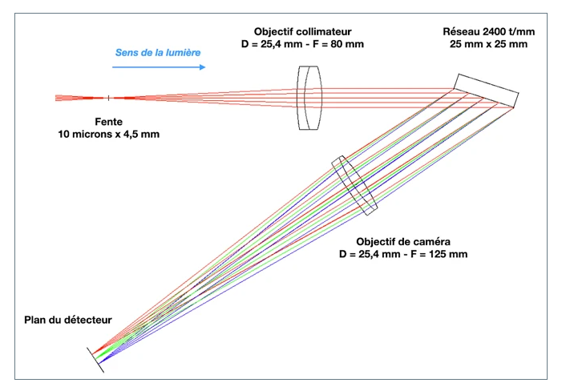
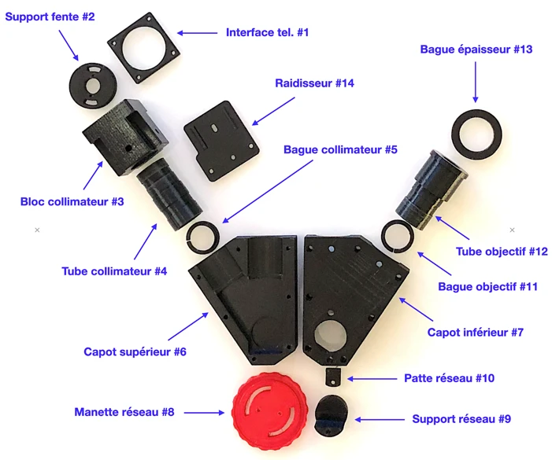
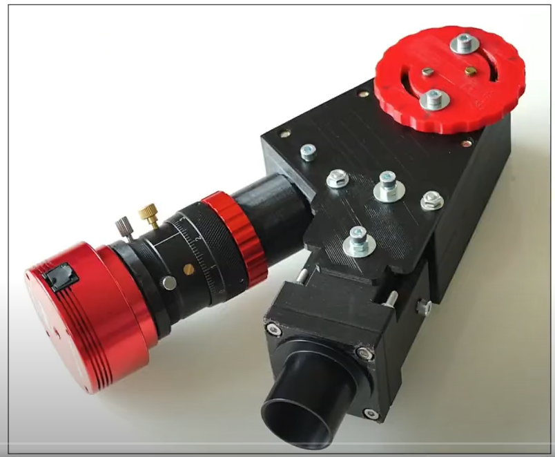

Slit Spectrometer Project Log
====
The project is to build a slit spectrometer using a 300 lines/mm transmission grating and slit that I bought off of amazon for only $10 a piece. It will be based on the Sol'Ex spectrometer built by Christian Buil.
http://www.astrosurf.com/solex/sol-ex-presentation-en.html

**12-14-24**

Worked on understanding what the 3d print for the spectrometer will look like. I watched the YouTube video about putting together the Sol'Ex kit, and I downloaded the stl files. I do not know where to get step files ofr this or even if they're available. I might join one of the forums and ask about this.

One of the parts is printed with the very fine "telescope" threads. It's the "interface_tel_m42_#1.stl file.threads totally worked! I was surprised. Klipper does no allow '#' in a file name and I got an odd error from it, but I change # to num and it printed. NOTE: the kits sold by Azure3D use aluminum inserts instead of printed threads now.

The Sol'Ex has the ability to focus the collimator lens on the slit and also focus the camera lens. I think that I can use the same focus tube and lens mount that is used in that instrument for mine.

12-21-24 

Focusing the camera lens in the design of this spectrometer is more difficult that the Sol'Ex because the surplus lens I found for it is only 50mm focal length. It would be difficult to fit a helical focuser in this design look they do for the Sol'Ex. I'm designing a 3d printed focuser to do this. The idea is to use the tube-within-a-tube focuser design, but just use a screw to adjust the position - instead of a rack and pinion or other type of mechanism.

12-26-24

I've been re-designing parts for the spectrometer in Fusion starting from the .stl files that you can download. Instead of making the spectrometer a box with a top and bottom, it will be a tube. The design has a "diving board" that connects the main spectrometer to the collimator block. The diving board wasbolted to the box in the .stl files. I've incoprated it into the main tube. I've redesigned the collimator block to make it easier to print iwhtout supports.

I tried printing the diving board, and I've made changes to it. Not sure if I'll print that part again, or just go for the whole thing. Printing the collimator block now.

I need to figure out how to hold the slit in place. 
Design the grating holder.
Design the focus tube and the camera lens holder. I've already taken a first pass at the focuser, but it doesn't have a way to hold the lens.
Count up the hardware necessary, and put some on order.

12-29-24

I've been working on the camera lens and focus mechanism. I have a design for that mechanism. I've printed the inner and outer tubes. The inner tube does not fit still.
I put the camera lens into the Fusion model, so I think I have a good position for the focus. I want to verify that this focus position is correct using the QHY camera.

On the slit side, I put the collimator lens into the model. The focus is far away from where I thought it would be. I looked at the Sol'Ex optics and the collimator lens has an 80 mm focal length. 
This explains why the focus in  model is 20 mm off. The focus position for the surplus lens I have should be ~94mm from the face of the optic.
I've put a screen shot of the optics in the pictures at the beginning of this log for reference.

I'll have to redesign the collimator block to accomodate the new focus position.

12-30-24

Yesterday, I redesigned that collimator block I made it about an inch longer.

I tried a design of the camera lens/focuser assembly. I used a loft to connect the grating attachment to the focuser tube. I printed it in a way that needed supports. I don't like the results because the part that 
comes into contact with the lens is not flat (due to the supports). I think that I could redesign in a way that would allow me to print in the other orientation and eliminate the need for supports. This would also 
smooth out the lens mating surface. 

The focuser inner tube does not fit very snuggly in the outer tube so it jiggles a little. This might be a problem for stability of the focus position. Even with it a little loose, the screw/spring focus mechanism can bind.
This might also be a problem. I'd like to make the fit more snug. I think this focus adjustment will be set and forget, so it might still be usable. Concerned about the binding and the spring...

I need to be better about only using the assembly drawing for part positioning, and then use a separate file to design the individual part. 
The focuser/camera lens holder/grating interface is too complicated to design in the assembly drawing.
The timeline is useful to go back and change things but the timeline in the assembly drawing is so long that I can't find operations in irder to modify them. (8-4-25 Note: this is definitely true!)

8-4-25
Lots of developments that I did not track here. I made the spectrometer, and I pointed it out the window and I was able to see the fraunhofer lines in the sunlight. That was pretty cool.

Some highlights:
I did not use the focuser that I was talking about in the 12-30-24 log entry. I redesigned the focuser that I've used on a couple of telescopes. I used a 1 mm thread for it (I think).

I didn't make a holder for the slit. I just cut the slits out and mounted them under the two screws that would normally hold the mount for the slits. 

I made a little curcuit that will flash a neon lamp, and I used that to to calibrate the sprectometer. I need to make a similar one for the Ar lamp I bought.

I'm making a dovetail to support the telescope and the spectrometer. I had to print it in two parts since it needs to be almost two times the largest dimension of the printer.  Once the dovetail is printed, I can try testing the spectrometer on a star.

I bought a flip mirror which hopefully I can use for positioning a star on the slit. It also takes up a bunch of the focus distance, so I don't need a bunch of adapters.
